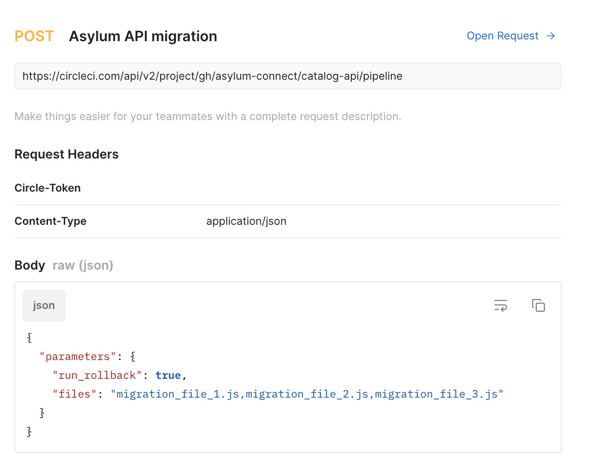

# Migrations

## How migrations are run?

In order to run migration in package.json there are 2 scripts:

```
"run-migration": "MIGRATION=true node $MIGRATION_FILE",
"rollback-migration":"ROLLBACK=true node $MIGRATION_FILE",
```

In circle CI there are workflows to run migration/rollback. They are triggered by a Postman to CircleCI API when the migration is merged into main branch.

Postman Example:


[Creating your CircleCI Token](https://circleci.com/docs/2.0/managing-api-tokens/)

## Migration files

This folder will contain all the migrations to the MongoDB. Schema changes that require default values to be set should be addressed with a migration.

release_date format - yyyy.mm.dd
action can be: update, deleted, insert

We recommend to follow the file pattern:

- migration/{release*date}*{action}\_short_description.js

The file should follow this template:

```
/*******************************************************************
 *  Release 2021-11-01
 *  Issue:  https://app.asana.com/0/1132189118126148/1176142788936875
 *  Description: This schema change will add is_deleted: false to all
 *               organizations services. When an organization service
 *               is soft deleted by a data manager it will not show up
 *              on General Org/Services queries
 * ******************************************************************


/* eslint-disable no-console */
require('babel-register')({
    presets: ['env']
});

require('dotenv').config({path:'.env'});
// Import DB Connection
require('../../src/db');

var mongoose = require('../../src/mongoose');

if (process.env.MIGRATION) {
	runMigrationScript();
}

if (process.env.ROLLBACK) {
	runRollbackScript();
}

```

Inside the runMigrationScript/runRollbackScript functions add the actual migration to the schema.
